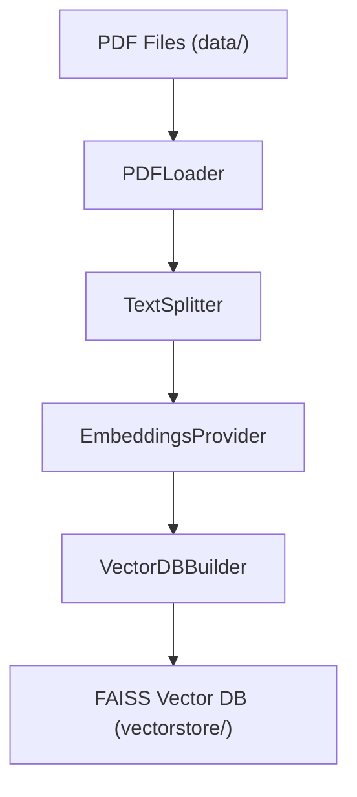
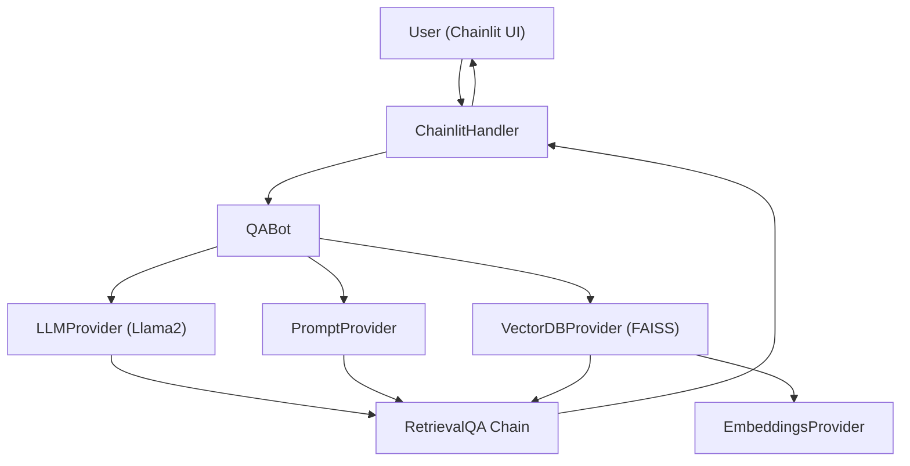

# Medical_RAG_Chatbot

Medical_RAG_Chatbot is a powerful tool designed to provide medical information by answering user queries using state-of-the-art language models and vector stores. The codebase is refactored using SOLID principles for maintainability and extensibility.

## Table of Contents
- [Introduction](#introduction)
- [SOLID Structure](#solid-structure)
- [Prerequisites](#prerequisites)
- [Installation](#installation)
- [Getting Started](#getting-started)
- [Usage](#usage)
- [GitHub Usage](#github-usage)
- [Contributing](#contributing)
- [License](#license)

## Introduction
This bot answers medical-related queries using a local Llama2 model and a FAISS vector database built from PDF documents.

## SOLID Structure
The codebase is organized into the following main classes:

### Ingestion Pipeline (`ingest.py`)
- `PDFLoader`: Loads PDF documents from a directory.
- `TextSplitter`: Splits documents into manageable chunks.
- `EmbeddingsProvider`: Provides sentence embeddings.
- `VectorDBBuilder`: Builds and saves the FAISS vector database.
- `IngestPipeline`: Orchestrates the ingestion process.

### Chatbot Logic (`model.py`)
- `PromptProvider`: Supplies the prompt template for the LLM.
- `LLMProvider`: Loads the Llama2 model.
- `EmbeddingsProvider`: Provides sentence embeddings (shared with ingestion).
- `VectorDBProvider`: Loads the FAISS vector database.
- `QABot`: Orchestrates the retrieval QA chain.
- `ChainlitHandler`: Handles Chainlit events and decouples UI from core logic.

## Architecture

### Ingestion Pipeline Flow


### Chatbot Query Flow


## Prerequisites
- Python 3.8 or higher
- Git
- Required Python packages (see `requirements.txt`)

## Installation
1. **Clone the repository:**
   ```bash
   git clone https://github.com/your-username/Medical_RAG_Chatbot.git
   cd Medical_RAG_Chatbot
   ```
2. **Create and activate a virtual environment:**
   - On Windows:
     ```bash
     python -m venv venv
     venv\Scripts\activate
     ```
   - On macOS/Linux:
     ```bash
     python3 -m venv venv
     source venv/bin/activate
     ```
3. **Install the required packages:**
   ```bash
   pip install -r requirements.txt
   ```

## Getting Started
1. **Prepare your data:**
   - Place your PDF files in the `data/` directory.
2. **Build the vector database:**
   ```bash
   python ingest.py
   ```
3. **Start the chatbot:**
   ```bash
   chainlit run model.py
   ```
4. **Open your browser:**
   - Go to the URL provided by Chainlit (usually http://localhost:8000) to interact with the bot.

## Usage
- Interact with the bot via the Chainlit UI.
- Ask medical questions; the bot will respond using the ingested knowledge base.

## GitHub Usage
- To use this code in your own GitHub repository:
  1. Fork or clone this repo.
  2. Push to your own GitHub account.
  3. Update the project name, description, and links as needed.

## Contributing
Contributions are welcome! Please open issues or pull requests for improvements or bug fixes.

## License
This project is licensed under the MIT License.
